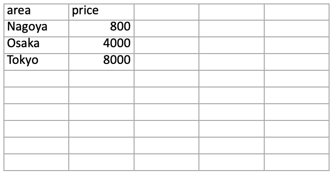

# CSV 自動集計ツール（auto-tool）

このツールは、複数のCSVファイルをまとめて集計し、
Excelファイル（.xlsx）として出力するPythonツールです。
CSVの集計・整理・Excel出力・条件指定対応まで可能。
実務のExcel作業を大幅に自動化します。

---

## 主な機能

- dataフォルダ内のCSVを一括読み込み
- 月別・エリア別の売上集計
- 条件指定（月・エリア）による集計
- 集計結果をExcelに自動出力
- ワンクリック実行（GUI対応）

---

## 使用技術

- Python
- pandas
- tkinter（簡易GUI）

---

## 使い方

1. dataフォルダに集計したいCSVファイルを入れる
2. ターミナルで以下を実行

## 実行例
$ python3 app.py

## 実行画面

### GUI画面

一括集計を押すと↓↓↓

### 出力結果

## 結果
all_total.xlsx が作成されます
